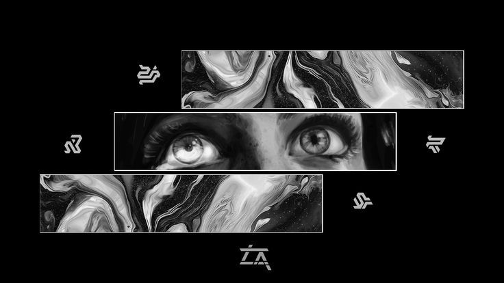

  

<h2 align="center">Hello👋🏻, Amrita Pandey here.</h2> 

<strong>🚀 Engineering Student | Programmer | Tech Explorer</strong>
  

Passionate about learning and builiding solutions with <strong>C++, Python and Java.</strong>
 
<i>
Thriving in the journey of Machine Learing and technology.
</i>

  <strong>💻 Tech Stack:</strong> 

  
  
  
  
  
    
  
  
  
  
  <ig src="https://img.shields.io/badge/Matplotlib-%23ffffff.svg?style=plastic&logo=Matplotlib&logoColor=black" alt="Mathplotlib">

  <strong>📊 GitHub Stats:</strong>

  

  

  

---
